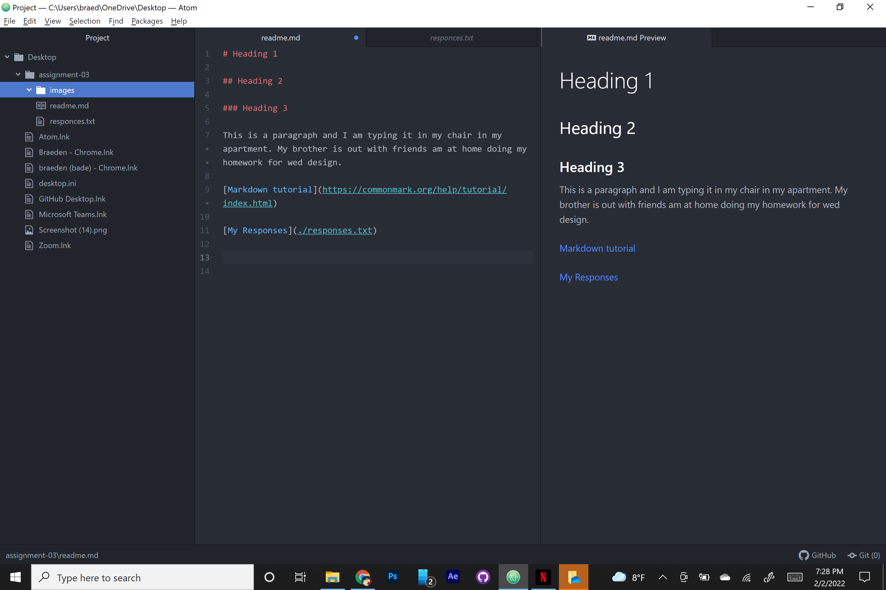

# Heading 1

## Heading 2

### Heading 3

This is a paragraph and I am typing it in my chair in my apartment. My brother is out with friends am at home doing my homework for wed design.

[Markdown tutorial](https://commonmark.org/help/tutorial/index.html)

[My Responses](./responses.txt)

Question Number 7 answer

First I learned that text editor (Atom) can be connected to my computer files. Second I learned today in fact that the internet at one point was made to survive a nuclear attack. And third I learned that web designers use websites like github to store repositories online.
